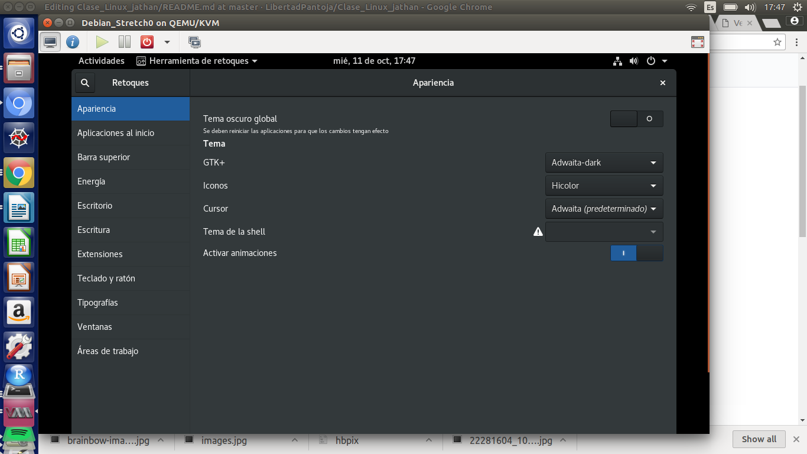

# Clase_Linux_jathan
Apuntes de la clase de Debian: **Debian 9 stretch**


# Table of contents
1. [Jerarquía de directorios](#directorios)
	1. [bin](#bin)
	2. [boot](#boot)
	3. [dev](#dev)
	4. [etc](#etc)
	5. [home](#home)
	6. [lib](#lib)
	7. [media](#media)
	8. [mnt](#mnt)
	9. [opt](#opt)
	10. [sbin](#sbin)
	11. [srv](#srv)
	12. [tmp](#tmp)
	13. [usr](#usr)
	14. [local](#local)
	15. [var](#var)
2. [Comandos básicos y configurar repositorios en Debian](#com)
3. [vi](#vi)
4. [Shortcuts en terminal y algunos comandos](#terminal)
5. [Ambientes gráficos](#ambientes)


## Jeraquía de directorios en New Linux <a name="directorios"></a>

	Todo para new Linux son archivos
  
  ### En bin <a name="bin"></a>
  
  Hay binarios escenciales para correr comandos
  
  ### En boot <a name="boot"></a>
  
  Todo lo relacionado al sector de arranque
  
  ```
  cd /
  ls -la boot/
  ```
  ### En dev <a name="dev"></a>
  
  Archivos del dispositivo
  
  ### En etc <a name="etc"></a>
  
 archivos host, configuración del sistema
 
 ### En home <a name="home"></a>
 
 Se guardan los archivos de los usuarios (aquí s ecrean los directorios personales)
 
 ### En lib <a name="lib"></a>
 
 Están las bibliotecas. Prestas un recurso que es regresado.
 
 ### En media <a name="media"></a>
 
 Puntos de montaje de cosas extraíbles que ya reconoce el sistema previamente (montado con sesión gráfica).
 
 ### En mnt <a name="mnt"></a>
 
 Punto de montaje para sistemas de archivos temporalemnte montados
 
 ### En opt <a name="opt"></a>
 
 Paquetes adicionales que nostros instalamos
 
 ### En sbin <a name="sbin"></a>
 
 Archivos especiales del sistema sóloe ejecutados por el superusuario. No existen para el suusario sin privilegios.
 
 ### En srv <a name="srv"></a>
 
  Ctrl - shift t nuevo tab en terminal
  
  ### En tmp <a name="tmp"></a>
  
  Se guardan los qrchivos temporales mientras la sesión esté activa.
  
  ### En usr <a name="usr"></a>
  
  Aplicaciones y librerías para diferentes usuarios (who,whoami)
  
  #### En local <a name="local"></a>
  
  Cosas particulares de cada usuario, no se usa mucho en Debian
  
  ### En var <a name="var"></a>
  
  Archivos variables (paquetes instalados en debian). 
  
 ```
 ls -la /var/cache/apt/archives
 ```
  
  ### En root 
  
  Está el home del superusuario. Sólo se recomienda para tareas muy específicas. 
  
  ### En proc
  
  Todo lo relacionado a sistemas de archivos. Ejemplo:
  
  less proc/cpuinfo
  
  ## Comandos básicos y configurar repositorios en Debian <a name="com"></a>
  
  Super ususario debian es su
  
  Se entra primero como su
  
  ### man
  Manual, con el podemos ver información de un paquete, ejemplo para cosas de instalación
  
```
man apt-get 
```
  
  
  Correr update seguido de upgrade, de preferencia al menos una vez a la semana :D
  
  Siempre respaldar los archivos de configuración. Ejemplo:
  
  ```
  cp etc/apt/sources.list etc/apt/sources.list_original
  ```
## vi <a name="vi"></a>

vi y vim (vi mejoado) son editores de texto para la terminal que funcionan con comandos (modo de entrada) y con edición directa.

  * dd borrar una línea completa en vi en modo de entrada (escape)
  * Para entrar al modo de edición usar Insert
  * Para acceder al modo entrada presionar Esc
  * Para guardar:
  	* shift zz
  	* : w  Sólo escribir (guardar cambios)
  	* : wq Escribir y salir
  	* : x Guardar y salir
  * o crea una línea nueva en modo entrada (Esc)
  * gg Shortcut para ir hasta arriba en modo entrada (Esc)
  
  ## Shortcuts en terminal y algunos comandos <a name="terminal"></a>
  
  Ctrl -p y Ctrl -n ayuda a desplazarse en el historial
  
  Ctrl -a manda el cursor al inicio de la líne en la que estás escribiendo en la terminal
  
  Shift repag/avpag para moverse en la terminal (scroll)
  
  Ctrl -e lleva el cursor al final de la línea en la que estás escribiendo en la terminal

  Ctrl - r busca comandos en el historial por filtro

  less ver contenido de archivos

## Ambientes gráficos <a name="ambientes"></a>

### GNOME shell

Intefaz gráfica muy completa

#### Tweak para costumizar: gnome-look.org

- En Tweak Se pueden obtener formas de ver los escritorios, se pueden modificar las áreas de trabajo, hacerse estáticas y determinar el número de ellas. 



En el menú **Máquina virtual** se pueden redirigir los dispositivos montados a la máquina virtual.

## Light 
